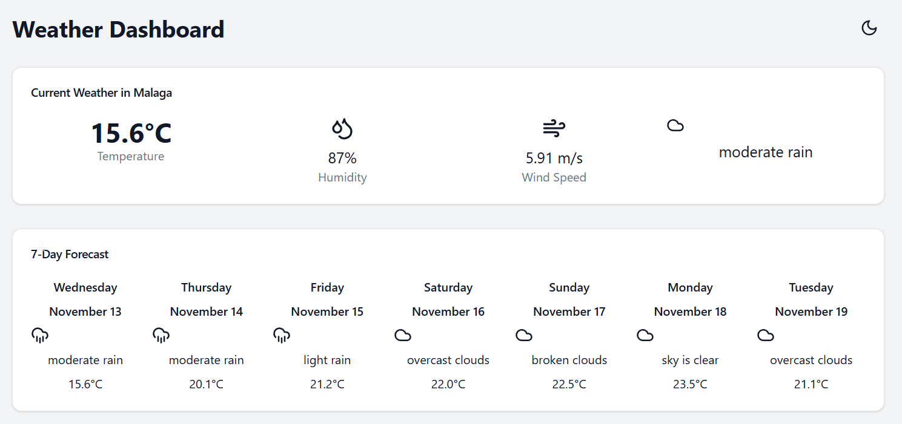

# Weather Dashboard
======================

A web application that visualizes the weather data for the current day and next 7 days.

## Overview
-----------

This weather dashboard provides a simple and intuitive way to view the current weather conditions and forecast for the next 7 days. The app uses a weather API to fetch the latest weather data and displays it in a visually appealing format.

## Features
------------

* Displays current weather conditions, including temperature, humidity, wind speed, and weather description
* Shows forecast for the next 7 days, including high and low temperatures, and weather conditions
* Visualizes weather data using charts and graphs
* Allows users to search for weather data by city or zip code

## Screenshot
-------------

## Live App
------------

You can view the live app here: [https://valiantsin2021.github.io/weather-dashboard](https://valiantsin2021.github.io/weather-dashboard)

## Technologies Used
--------------------

* Frontend: HTML, CSS, JavaScript, React
* Backend: Node.js
* Weather API: OpenWeatherMap API
* Deployment: Github

## Contributing
------------

Contributions are welcome! If you'd like to contribute to the project, please fork the repository and submit a pull request.

## License
-------

This project is licensed under the MIT License.